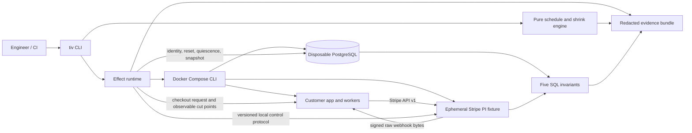
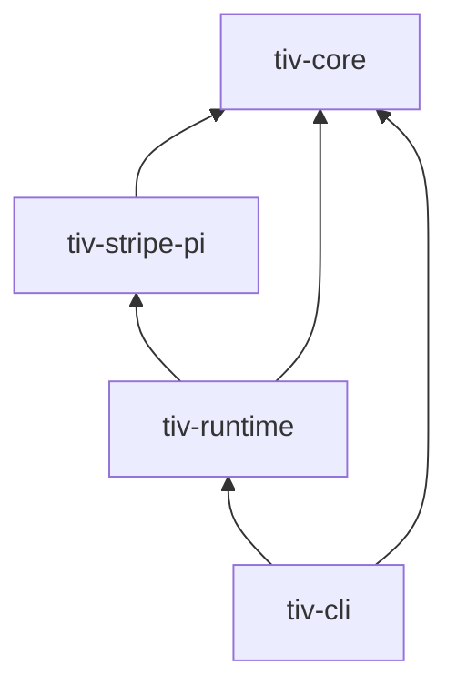
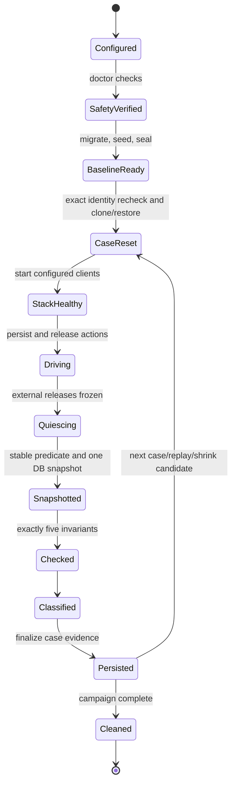

# TxProof Rust backend architecture plan

Status: proposed for review

Date: 2026-08-10

Scope: bounded v0 defined by the execution blueprint

Decision rule: build the truth spike first; fund the six-week implementation only after the commercial and technical gates pass

## Executive decision

TxProof should be built in Rust, but it should not be designed as a conventional web backend.

The product is a local verification control plane with one short-lived CLI, one ephemeral Stripe-compatible fixture service, a disposable PostgreSQL database, and a durable evidence bundle. It starts only for a run, controls Docker Compose and the fixture, searches valid external schedules, checks five repository-owned invariants, writes the evidence, and exits.

Rust is the right choice because the difficult parts are exact state transitions, byte-preserving webhook behavior, bounded process control, explicit error classification, low-level HTTP connection outcomes, and safe handling of destructive database operations. Rust does not make the customer application deterministic and must never be marketed as doing so.

The first implementation should use four physical crates, not the eight crates proposed in the original blueprint. The eight responsibilities remain architectural modules. A physical split is made only when it enforces a valuable dependency boundary, creates an independently shipped process, or has more than one real consumer.

## Product boundary

### What v0 is

- A local CLI for one Docker Compose application.
- A counterexample search engine for one Stripe PaymentIntent checkout and fulfilment flow.
- A stateful, fault-oriented Stripe-compatible test fixture.
- A PostgreSQL-only snapshot oracle with exactly five approved SQL invariants.
- A seeded compiler of state-valid schedules.
- A fresh-baseline replay and same-failure shrinker.
- A producer of redacted JSON, Markdown, JUnit, logs, checksums, and replay instructions.

### What v0 is not

- A hosted service, daemon, dashboard, or multi-tenant platform.
- A proof system or exhaustive model checker.
- A full Stripe emulator or Stripe-certified implementation.
- A generic provider/plugin framework.
- A production chaos agent or observability product.
- A controller for arbitrary customer threads, PostgreSQL scheduling, kernel timing, wall clocks, or entropy.
- A multi-database, Kubernetes, queue, subscription, refund, or payout verifier.

## Architectural principles

1. Safety precedes mutation. A destructive method cannot be called without a process-local capability produced by a fresh identity check.
2. Decisions precede effects. Every chosen action is persisted before the runtime releases the corresponding external effect.
3. Pure planning is separate from impure execution. The scheduler owns no sockets, processes, database connections, wall clock, or filesystem.
4. The trace is authority. A seed is useful for generating the original case; a versioned compiled trace is what replay executes.
5. Observations do not drive random choices. Async arrival order never consumes random numbers.
6. One actor owns each mutable model. The fixture, scheduler, and journal each have one writer.
7. Passing is bounded. A pass always names the adapter, model, seed/cases, budgets, exclusions, and compatibility fingerprint.
8. Inconclusive is a first-class result. Reset failures, quiescence timeouts, environment drift, and 1/3 reproduction are not money violations.
9. Artifacts are allowlisted projections. Generic object dumping and regex-only secret redaction are prohibited.
10. v0 is deliberately serial. `parallelism` accepts only `1` until isolation and performance evidence justify more.

## System shape



There are two planes:

- The control plane is the host `tiv` process. It owns configuration, safety, scheduling, Compose, database lifecycle, classification, shrinking, cleanup, and artifact finalization.
- The data plane is the customer stack plus the fixture. The fixture exposes a PaymentIntent API to the application and delivers signed webhook attempts to it. A separate control listener accepts only local, run-scoped commands from the CLI.

The proposed topology runs the fixture as a Compose service rather than a host-only server so Linux, macOS, and CI can share the application-to-fixture network path. The truth spike must validate that choice before it becomes a compatibility requirement. Development may use a locally built fixture image; signed host packages and a pinned OCI image remain Phase 5 distribution work. Once distributed, the manifest binds both versions and digests.

## Workspace and dependency direction

```text
tx-proof/
  Cargo.toml
  Cargo.lock
  rust-toolchain.toml
  crates/
    tiv-core/             # pure domain, compiler, validation and shrink transforms
    tiv-stripe-pi/        # PaymentIntent model, fixture server and control protocol
    tiv-runtime/          # Compose, PostgreSQL, HTTP driver, execution and artifacts
    tiv-cli/              # `tiv` binary, command dispatch, output and exit codes
  schemas/                # checked-in versioned config and trace schemas
  tests/
    reference-app/        # synthetic Compose SUT with switchable known bugs
    contracts/            # Stripe-shaped HTTP and webhook fixtures
    golden/               # stable config, trace, report and JUnit outputs
  docs/
    adr/                   # decisions that materially change safety or compatibility
```

Dependency direction:



### Physical crates

| Crate | Owns | Must not own |
|---|---|---|
| `tiv-core` | IDs, money types, plan/trace/result schemas, PaymentIntent action vocabulary, seeded compiler, trace validation, failure identity, shrink transforms | Tokio, HTTP, SQL, Compose, filesystem, environment, wall clock |
| `tiv-stripe-pi` | Single-writer provider model, idempotency cache, immutable events, raw webhook body/signature generation, provider/control HTTP protocols, fixture executable target | Compose, customer schema, campaign policy, final verdict |
| `tiv-runtime` | Config loading/resolution, safety preflight, command runner, Compose lifecycle, app driver, fixture client, PostgreSQL reset/oracle, execution state machine, observation journal, artifacts | Random schedule selection, provider business truth, CLI presentation |
| `tiv-cli` | Commands, progress and human output, signal entry point, exact exit-code mapping | Business logic, raw SQL mutation, fixture state |

The original `tiv-config`, `tiv-compose`, `tiv-postgres`, `tiv-http`, and `tiv-artifact` boundaries begin as modules inside `tiv-runtime`. They become crates only when one of these triggers is proven:

- independent release or reuse;
- dependency weight materially hurts unrelated builds;
- an enforceable security boundary is otherwise being violated;
- two teams need independent ownership;
- a second real consumer exists.

There is no plugin ABI in v0. Internal traits exist only where a pure engine test needs a fake effect boundary. Concrete adapters are preferred elsewhere.

## Core type model

Primitive strings must not cross important boundaries. Newtypes make invalid combinations difficult:

```text
RunId, CaseId, ActionId, CheckpointId, InvariantId
Seed, LogicalSequence, FixtureSequence, ObservationSequence
AmountMinor(i64), Currency(ISO-like validated code)
EventId, PaymentIntentId, IdempotencyKey
ConfigFingerprint, CompatibilityFingerprint, TraceHash, WitnessDigest
ComposeProjectId, DatabaseName, DatabaseOid, DatabaseMarker
```

Money is always integer minor units plus an explicit currency partition. Floating point and PostgreSQL `money` are rejected from the invariant contract.

### Planning and replay types

```text
CampaignSpec
  -> PlannedCase            seed-derived symbolic, state-valid action plan
  -> CompiledTrace          all external values needed for replay are bound
  -> ObservedTrace          compiled actions plus append-only observations
  -> CaseResult             held, violated, or inconclusive
  -> ReproductionResult     stable 3/3, reproducible 2/3, inconclusive 1/3
  -> ShrinkResult            original retained, optional minimized trace
```

`PlannedCase` and `CompiledTrace` are different types. A planned action may refer to “the PaymentIntent produced by action 3”; the compiled trace contains the concrete ID captured when action 3 executed. A trace cannot be marked replayable while an unresolved reference remains.

Every compiled action contains:

- stable action ID and logical sequence;
- explicit dependencies;
- action kind and validated parameters;
- named observable release boundary;
- fault outcome, delay, or delivery multiplicity;
- bound dynamic values once known;
- compatibility-relevant adapter version;
- canonical content hash.

Replay validates the dependency graph and all bound values, then executes it directly. It does not rerun the RNG.

### Result types

```text
CaseVerdict = Held | Violated(Violation) | Inconclusive(InconclusiveReason)

FailureIdentity = InvariantId + CheckpointId
Violation = FailureIdentity + WitnessDigest + bounded evidence

RunErrorClass = Configuration | Safety | Infrastructure | Interrupted
```

The normalized witness digest is evidence, not the default shrink identity. v0 accepts a shrink candidate only when the same invariant fails at the same named checkpoint in at least two of three fresh-baseline attempts.

## Determinism boundary

The scheduler is a pure state transition:

```text
(model state, ordered eligible actions, deterministic decision stream)
  -> (chosen action, next model state, decision record)
```

Rules:

- `ChaCha20Rng` is the only campaign decision generator.
- The exact crate/algorithm version and decision count are stored in the trace header.
- Eligible actions are sorted by a stable semantic key before an index is sampled.
- One scheduler task owns the RNG.
- Network, process, database, and journal tasks never receive the RNG.
- Wall-clock timestamps, task completion order, log arrival, generated OS randomness, and retry timing never affect eligibility or consume decisions.
- Deterministic fixture object IDs derive from `(adapter version, seed, logical sequence, object kind)` through a domain-separated hash.
- Random database safety markers and run-control tokens come from the OS and are deliberately not deterministic.
- Logical model time, monotonic elapsed time, and wall-clock signature time are distinct types.

The fixture regenerates a webhook attempt timestamp and signature on replay while preserving event ID and exact raw JSON body. This is required because stale signatures are normally rejected.

## Runtime execution state machine



No transition is implicit. Each transition has a timeout, typed observation, error class, and recovery text. A journal record for an action intent is flushed before the effect is issued; an outcome record follows it.

## Component contracts

### Configuration

Configuration has three representations:

1. `RawConfig` is deserialized from versioned TOML with unknown fields denied.
2. `ResolvedConfig` contains canonical paths, probed capabilities, normalized URLs, validated budgets, and secrets resolved from environment-variable names.
3. `RedactedConfig` is an allowlisted serializable projection.

`ResolvedConfig` and secret wrappers do not implement `Serialize` or revealing `Debug`. Commands never persist the process environment. Semantic validation runs after deserialization and rejects:

- schema versions the binary cannot migrate;
- anything other than five unique invariants;
- non-local or public targets;
- live/restricted-live Stripe key prefixes;
- production Stripe hosts;
- missing or ambiguous Compose services;
- database names outside an internally generated lowercase ASCII contract;
- unsafe sizes, timeouts, body limits, or action budgets;
- unsupported Stripe adapter/API versions;
- `parallelism != 1` in v0.

`schemars` generates a pinned JSON Schema during development. The checked-in schema is diffed in CI; runtime correctness still comes from Rust deserialization and semantic validation.

### Safety and mutation capabilities

The PostgreSQL API uses type state:

```text
DatabaseTarget<Unverified>
  --fresh preflight--> DatabaseTarget<Verified> + single-use MutationPermit
```

`MutationPermit` is private, process-local, non-cloneable, non-serializable, short-lived, and consumed by the destructive call. `doctor` may persist evidence, but a later `baseline`, `run`, `replay`, `shrink`, or `cleanup` never trusts an earlier attestation. It rechecks immediately before mutation.

The identity tuple is:

```text
server fingerprint
+ server address/port
+ exact database OID and generated name
+ owner OID
+ marker UUID and marker kind
+ Compose project ID
+ expected application role
```

The truth spike must determine the strongest portable server fingerprint available to the supported PostgreSQL roles. The preferred candidate is the cluster system identifier; a weaker fallback may not be silently substituted.

Additional controls:

- connect from an admin connection to a separate maintenance database, never through the target database;
- terminate sessions only where `datid` equals the freshly verified target OID;
- accept only generated identifiers matching the narrow database-name grammar before quoting;
- verify database size before baseline/reset;
- bind the acknowledgement text to the exact identity tuple;
- never mount the Docker socket inside the fixture or customer service;
- use argv arrays for every command; shell evaluation is prohibited;
- clear inherited command environments and pass only an explicit allowlist required by Docker/PostgreSQL plus scoped secrets;
- serialize campaigns per Compose project with a host lock;
- attempt cleanup after interruption, then print exact manual recovery commands scoped to the run ID.

### Schedule compiler

The compiler contains the minimal PaymentIntent state machine and enumerates only currently eligible actions. It samples from that ordered set; it never generates invalid actions and rejects invalid externally supplied traces.

The action vocabulary is intentionally closed in v0:

- drive checkout;
- create, confirm, or retrieve PaymentIntent through the fixture;
- return normal, pre-execute 429/500, post-execute 500, commit-then-close, or commit-then-delay;
- generate a provider event;
- deliver, duplicate, delay, reorder, or drop an event attempt;
- retry a business request or provider request;
- issue one SIGKILL at an approved observable boundary;
- restart and await health;
- wait for quiescence and check one named checkpoint.

Async outcomes may fill values already reserved by the plan, but do not request new random choices.

A business action carries an action-scoped provider script, rather than one
provider outcome. This is required because the reference checkout performs one
internal retry after a transport close before the business request returns.
The v1 script is bounded to one call, or exactly two calls where the first is
`commit_then_close`; each committed call reserves a distinct, occurrence-indexed
PaymentIntent output in the compiled trace. The terminal script outcome drives
the next business phase, while ambiguity and provider-object cardinality include
every call in the script.

Before an effect executes, the runtime resolves every occurrence-indexed input
binding from prior captures and passes the exact value to the adapter. Provider
retrieval and confirmation therefore operate on the PaymentIntent named by the
compiled trace; they never rediscover an implicit "active" object.

The loopback provider HTTP adapter checks both sides of every planned outcome:
the driver/provider status or transport result, and the fixture state delta.
That includes exact fault-queue consumption, object cardinality and identity,
operation metadata, confirmation status, held-gate lifecycle, and the invariant
that retrieval consumes no fault. A mismatch is an execution failure rather
than an accepted approximation.

### Fixture

The fixture is a single-writer actor. Its state includes:

- PaymentIntent objects and allowed transitions;
- idempotency entries keyed by route, key, and canonical parameter digest;
- immutable provider events;
- webhook delivery attempts;
- held or delayed HTTP outcomes;
- a fixture sequence and logical time;
- run-scoped control authorization.

Idempotency behavior for API v1 is modeled as follows:

- after endpoint execution begins, cache the first status code and response body, including a 500;
- the same route/key/parameters returns that cached result;
- changed parameters for the same key fail;
- validation or conflict before execution begins is not cached.

Webhook behavior:

- event ID and raw JSON bytes are immutable;
- each delivery attempt receives a fresh timestamp and HMAC-SHA256 signature;
- signing uses `timestamp + "." + raw_body` exactly;
- duplicates preserve the same event object;
- order is controlled at the event-attempt layer, not at packet level;
- a drop means no delivery before the declared reconciliation horizon.

The reference application preserves each authenticated provider event ID in a
durable `processed_webhook_events` relation, records authenticated attempts in
`webhook_deliveries`, and records business-effect applications separately in
`webhook_effects`. Each attempt first claims the primary-key event ID with
`INSERT ... ON CONFLICT DO NOTHING`, then inserts a delivery through the exact
event/operation composite foreign key. A colliding event ID for another
operation therefore aborts before payment state can change. The repaired row-1
mode applies the effect only when the event claim succeeds; the faulty mode
applies it on every identity-valid delivery. Each delivery has an
application-generated UUID. Applied effects create a delivery-bound
`ledger_entries` header and fixed `ledger_postings`: a
`processor_clearing` debit and `order_payment_liability` credit for the exact
positive amount and currency. Composite foreign keys bind the journal header
to the authenticated delivery and order value, and postings back to the header
value. Faulty row-6 mode writes a new debit-only header on a duplicate whose
effect is already deduplicated; repaired mode writes nothing for that
duplicate. All writes share one transaction, and the application role has
insert-only access to these relations; the read-only invariant role alone can
enumerate them. Duplicate-effect and one-sided-ledger faults are mutually
exclusive at process startup, so health never advertises a fault hidden by
branch precedence.

The row-4 caller pair is independently selected once at process startup. After
a successful checkout response is durably observed and the application is
SIGKILLed before caller acknowledgement, faulty mode treats the caller retry as
a new provider create. Repaired mode instead queries the synthetic fixture by
the immutable operation metadata, creates only when the lookup is empty, fails
closed on multiple or paginated matches, and reuses the one validated
PaymentIntent.
The local `payments` relation enforces uniqueness for the operation/provider
pair and uses a conflict-safe insert, so recovery cannot duplicate the local
representation. The temporary provider projection carries that validated
operation ID, and `provider-object-unique` starts from provider state before it
left-joins local payments, so duplicate provider objects remain visible even
when no local row represents one. This operation search is a bounded fixture
protocol for the reference proof, not a statement about a general Stripe
metadata-search API.

The implemented action-level control slice uses two exact, sequenced commands:
`generate-event` confirms the PaymentIntent resolved from the compiled trace and
captures its immutable event ID; `deliver-event` signs that exact event with a
fresh timestamp and makes the fixture perform the application-facing HTTP
request. The runtime keeps a deterministic per-case queue for delay, reorder,
drop, delivery, and duplication. It never receives an application webhook URL
or forwards the signed body itself. Both HTTP clients ignore ambient proxies,
reject redirects, and use bounded timeouts. A non-2xx application response
fails the delivery action without removing the pending event.

The serial case HTTP adapter owns the provider and webhook adapters together.
After each successful effect it transfers the exact validated fixture command
sequence to the other adapter, preventing a later webhook command from
replaying a sequence already consumed by a provider-gate release. The
reference application also exposes only the supported PaymentIntent confirm
and retrieve routes as a bounded proxy to its internal fixture address. Its
repaired caller mode also uses the fixture's exact operation-metadata search
route internally; that route is never exposed through the application proxy.
The proxy preserves provider status/body and propagates a real upstream
transport close by ending the driver connection; the host does not receive a
fixture data-plane port.

The reference planned-case runner validates the compiled plan before mutation,
installs the exact flattened provider fault scripts, and executes the full
serial plan into a durable journal. It supports two honest process cut points:
`client_request_forwarded` after the fixture has committed and held its
response, and `client_response_observed` after the driver has validated and
durably journaled an application response while its logical delivery remains
blocked. The runner sends SIGKILL to the exact locally attested application
container, proves that container stopped, starts the same container, and waits
for both application health and full three-service re-attestation. Releasing
the provider gate must then end the killed in-flight driver request without a
manufactured response. Case-derived operation identity and a narrow durable
order read let a restarted application recover webhook routing from PostgreSQL
instead of process RAM.

Webhook-response cut points are supported only when immediately owned by a
real fixture delivery. The reference SQL probe is supported only around the
initial checkout: it proves the case-owned payment predicate false before the
action, observes the first true value through `tiv_invariant`, and journals it
before the immediately following kill. Abstract placements remain unsupported
and are rejected before stack inspection or database provisioning. The
reference-only
quiescence gate requires no held provider request, no queued webhook, no held
fixture gate, no unexplained unused provider outcome, and a validated provider
projection. A recovered caller request accounts exactly for its intentionally
unconsumed planned create outcome; any other remainder is an execution error.
The final checkpoint yields the unforgeable permit consumed by the existing
five-query PostgreSQL oracle. Self-contained public runs allocate the next
authenticated fixture sequence so multiple commands can run serially on the
same isolated stack.

This slice is proven through real loopback fixture and application endpoints
and the live Compose reference runner. Durable fixture delivery-attempt history
and the configured customer-repository SQL file remain later integration
boundaries.

The proposed fixture topology has separate data and control listeners. The data listener is reachable by the SUT on an internal Compose network. The control listener is published only to loopback and requires an unlogged run token plus a monotonic command sequence. Control DTOs are versioned. The truth spike must prove that this protocol is necessary and portable before it becomes part of trace compatibility.

Normal health/control HTTP can use ordinary request handling. The provider data path uses Hyper's lower-level connection API because `commit_then_close` must mutate the provider model and then end the TCP connection without manufacturing an HTTP response. The truth spike must prove the exact behavior against a real client before the abstraction is generalized.

The fixture is not a byte-for-byte Stripe clone. Unsupported routes, parameters, states, or API versions fail loudly and become configuration/setup failures rather than invented provider behavior.

### Observable cut points and crash injection

Supported cut points are external and honest:

- caller request forwarded;
- application response observed but designated lost to the logical caller;
- webhook request forwarded;
- webhook response observed but designated unacknowledged by the logical sender;
- customer SQL probe first becomes true.

At an implemented cut point, the responsible driver/fixture task records the observation and blocks on a gate. The orchestrator persists it, invokes:

```text
docker compose --project-name <exact> ... kill --signal SIGKILL <configured-service>
```

and then releases or closes the held operation according to the trace. The
current reference runner implements `client_request_forwarded`, the
application-checkout form of `client_response_observed`, and the
fixture-delivery form of `webhook_response_observed`. It also implements the
repository-owned `sql_probe_file` resolved from the typed project
configuration. The predicate must be parameter-free, begin false immediately
before its owning action, and first become true through a committed read-only
snapshot under the freshly attested invariant role. The runner uses
the already-attested local Docker container ID rather than ambient Docker
context. Restart starts that exact stopped container, then repeats full Docker
attestation and application-health checks before execution continues.

The report calls these “observable external cut points.” It makes no source-line or instruction-level crash claim.

### Docker Compose adapter

The adapter is a typed wrapper over the Docker Compose CLI, not a daemon SDK and not a YAML framework.

Every invocation specifies:

- exact `--project-name`;
- canonical `--project-directory`;
- every explicit `--file` in resolved order;
- non-interactive, bounded output;
- a command timeout and cancellation behavior;
- argv-level redaction before journaling.

`doctor` probes the real commands/capabilities used by TxProof and captures `docker compose config` as the resolved, redacted compatibility input. It does not rely only on a version string.

The generated override adds the fixture service, the internal fixture network, loopback control publication, adapter/version labels, and test-only Stripe endpoint environment expected by the customer repository. It does not rewrite unrelated customer services.

The process runner sets `kill_on_drop` as a backstop but still kills and awaits timed-out child processes explicitly. Tokio documents that dropping a child handle does not stop the process by default.

### PostgreSQL baseline and reset

Baseline creation:

1. Create an isolated Compose project and generated case database.
2. Run the repository's migration and synthetic seed commands.
3. Stop every configured database client.
4. Verify no sessions remain on the source.
5. record a baseline identity marker and compatibility facts.
6. seal the baseline against application connections.

Preferred reset:

1. acquire a fresh mutation permit;
2. terminate sessions for the exact verified case OID only;
3. drop only the generated case database;
4. clone the sealed baseline with `CREATE DATABASE ... TEMPLATE`;
5. reapply database-level ownership/privileges;
6. replace the copied baseline marker with a distinct case marker;
7. revalidate identity before starting clients.

PostgreSQL requires no connected sessions on the template source while copying. Template cloning is therefore a capability proven by `doctor`, not an assumption.

Fallback reset uses a custom-format `pg_dump` and `pg_restore --single-transaction --exit-on-error`. `doctor` verifies client/server version compatibility. The baseline dump is trusted local test input, mode `0600`, excluded from CI artifacts, and deleted by the process-owned `BaselineArchive` lifecycle. The artifact-only `tiv cleanup` command does not scan or recover temporary baseline archives.

Transactions, exported snapshots, copied live volumes, and rollback of one connection are not accepted as whole-application reset strategies.

### Quiescence and invariant oracle

Before a checkpoint, the executor:

1. freezes further external action release;
2. waits for the customer SQL predicate to remain true for the configured stable interval, or uses the narrow synchronous-app stable-period contract;
3. times out to `Inconclusive`, never `Violated`;
4. snapshots immutable fixture objects and event-attempt history;
5. loads those rows into connection-local temporary tables;
6. starts one `READ ONLY REPEATABLE READ` transaction;
7. executes exactly five prepared invariant queries against one stable database snapshot;
8. rolls back and unfreezes only when the trace requires more actions.

Temporary fixture tables are created and populated on the same session before the read-only snapshot transaction. The provider actor remains frozen while the transaction runs.

Invariant files are trusted repository code, but still have a narrow contract. The initial interpreter subset proposed below requires explicit approval during Phase 1; it is not an unstated narrowing of the blueprint. If a real approved repository invariant needs parameters or another read-only form, extend the typed contract deliberately rather than inventing a parser rule.

- initially, exactly one parameter-free `SELECT` or `WITH ... SELECT` statement;
- zero rows means the invariant holds;
- returned rows are bounded witnesses;
- diagnostic columns use supported non-floating types;
- statement timeout, lock timeout, row cap, per-value byte cap, and total evidence cap are enforced;
- execution uses the least-privilege invariant role;
- the transaction is always rolled back.

The five invariant IDs are fixed in v0:

1. provider object uniqueness;
2. at-most-one business effect per webhook event;
3. paid-order amount conservation by currency;
4. terminal success monotonicity;
5. balanced ledger, or an approved entitlement-safe replacement for non-ledger products.

Full database equality is not an oracle. Generated IDs, timestamps, audit rows, and implementation detail may legitimately differ.

### Observation journal and artifacts

There is one journal writer. Producers send typed observations over a bounded channel; the writer assigns a global observed sequence, preserves producer-local sequence, computes the BLAKE3 link, appends, flushes at effect boundaries, and acknowledges durability.

Each record contains:

```text
schema version, run/case/action IDs, producer and producer sequence,
observation kind, monotonic elapsed time, optional wall-clock metadata,
allowlisted payload or payload digest, previous hash, record hash
```

The global order means “the order the control plane durably observed,” not a claim about total causality inside the SUT.

Hash inputs have a documented canonical representation: fixed struct field order, `BTreeMap` for maps, explicit enum tags, no floats, and golden normalization tests. Artifact checksums hash the exact bytes written. Ordinary `serde_json` output is not described as canonical JSON merely because it is deterministic in one build.

Artifacts are built in a private staging directory. The journal begins as recoverable append-only NDJSON; finalization compresses bounded logs/journal, writes derived reports, writes checksums, writes the manifest last, and atomically renames the directory. Interrupted partial runs remain inspectable and are never presented as complete.

```text
.tiv/runs/<run-id>/
  manifest.json
  config.redacted.json
  compose.resolved.redacted.json
  trace.original.json
  trace.minimized.json              # only when a valid minimum exists
  observations.ndjson.zst
  fixture/final-state.redacted.json
  invariants/<id>.json
  logs/<service>.log.zst
  summary.json
  summary.md
  junit.xml
  checksums.txt
  replay.txt
```

The manifest binds tool and adapter versions, trace schema, repository commit and an explicitly scoped worktree-status fingerprint, Compose hash, container digests, PostgreSQL facts, invariant hashes, config hash, OS/architecture, database identity, fixture image digest, and safety attestation. The status fingerprint is not described as a dirty-content hash: execution-relevant inputs are bound separately through the redacted configuration, compatibility document, and typed authority-file digests.

### Implemented manifest-v2 provenance contract

New configured campaign, replay, shrink, and minimized-replay artifacts emit
strict manifest schema `2`; the verifier continues to accept existing complete schema-`1`
artifacts. A complete v2 manifest records one typed artifact kind, one coherent
result, and its exact public exit code. Campaigns may be `held` (`0`) or
`counterexample` (`10`); configured and minimized replays may be `counterexample` (`10`) or
`inconclusive` (`4`); shrinks may additionally be `budget_exhausted` (`11`).
Partial artifacts have no result or exit code and cannot be inspected as
complete artifacts.

Repository provenance is diagnostic metadata, never mutation authority. It
records the resolved Git commit, `clean` or `dirty`, and the BLAKE3 digest of
the exact bytes returned by `git status --porcelain=v1 -z --untracked-files=all
--ignore-submodules=none`. The manifest tags that digest with format
`git_porcelain_v1_z` and scope
`tracked_index_worktree_and_non_ignored_untracked_with_non_recursive_submodules`.
This binds status codes and paths, including non-ignored untracked entries, but
does not bind dirty file contents or recursively attest submodule contents.
Relevant executed configuration remains bound by `config.redacted.json` and
`compatibility.json`. The bounded Git probe clears the inherited environment,
keeps only the executable search path and fixed locale/Git controls, suppresses
Git output from errors, and fails before execution after five seconds or one
MiB of status output. Capture occurs under the Compose-project lock and, for
replay and shrink, after compatibility attestation immediately before staging.

The finalizer derives every bound digest from its own indexed-file map. Complete
artifacts require both the redacted configuration and compatibility document;
only then may safety state be
`initial_execution_boundary_attested`. An earlier partial run uses
`not_reached`. Authority roles are fixed to canonical files:
`campaign-plan.json`, `cases/case_*/trace.json`, `source.json`,
`trace.original.json`, and optional or required `trace.minimized.json`, according
to artifact kind. Replay, shrink, and minimized-replay manifests contain exactly
one cryptographic source-artifact identity; campaign manifests contain none. The
verifier rejects incoherent kind/result/exit-code, source-count,
role/path/schema, safety, or digest combinations.

These checks provide bounded local integrity and provenance for a finalized
directory. They are not a signature, transparency log, or hostile same-user
chain of custody. A same-user filesystem or worktree race remains possible;
consumers therefore reverify indexed bytes when reading them, and compatibility
plus the disposable-database safety boundary—not Git metadata—govern execution.

Redaction is structural:

- headers, cookies, URLs, environment names, and payload fields have explicit allowlists;
- authorization values, keys, passwords, run tokens, and webhook secrets have non-serializable types;
- raw customer request/response bodies are hashed by default;
- exact fixture-generated webhook bytes may be stored because the test-data contract is synthetic, but secret-bearing metadata is excluded;
- configured attempts persist one private violation-only witness bundle;
  generic repository rows are digest/count-only, while exact rows require the
  strict synthetic reference-ledger allowlist and share an 8 KiB per-attempt
  cap with explicit omission/truncation metadata; reports expose only identity
  and count;
- truncation is explicit and hashed; silent truncation is prohibited.

### Error, classification, and exit contracts

Internal errors retain class, operation, source, evidence path, and recovery action. The CLI maps only at the outer boundary:

| Exit | Meaning |
|---:|---|
| `0` | all completed cases held all five invariants |
| `2` | invalid configuration or failed safety preflight; no unsafe mutation |
| `3` | setup/infrastructure failure; no product conclusion |
| `4` | flaky or inconclusive counterexample |
| `10` | reproducible invariant violation |
| `11` | reproducible violation retained; shrink budget exhausted |
| `130` | interruption; cleanup attempted and recovery emitted |

The command surface remains:

```text
tiv init
tiv doctor [--config tiv.toml]
tiv baseline [--config tiv.toml]
tiv run [--seed U64] [--cases N] [--ci]
tiv replay configured --artifact PATH [--config tiv.toml] --case N
tiv replay minimized --artifact SHRINK_PATH [--config tiv.toml]
tiv shrink configured --artifact REPLAY_PATH [--config tiv.toml] [--max-candidates N] [--max-time 10m]
tiv inspect PATH
tiv cleanup --run RUN_ID [--config tiv.toml]
```

`replay` fails before mutation if the compatibility fingerprint is missing or incompatible. `inspect` never executes customer code.

### Implemented complete-artifact inspection contract

`tiv inspect PATH` is a synchronous, read-only trust-boundary command. It
accepts only a finalized complete run directory whose private permissions,
manifest (schema `1` or `2`), bounded file set, exact byte digests, checksum
index, and v1 compatibility document all verify. Partial, corrupt, malformed, oversized, or
unsafe artifacts fail with exit `2` and no success document on standard output.

Successful inspection emits a versioned JSON receipt containing only the run
ID, complete status, verification flags, and indexed-file count. It does not
load project configuration, inspect evidence payloads, contact Docker or
PostgreSQL, or execute customer code. Paths, compatibility contents, summary
contents, filenames, and digests are deliberately excluded from the public
receipt so that inspection cannot turn secret-bearing evidence into CLI output.

### Implemented exact-run artifact cleanup contract

`tiv cleanup --run RUN_ID [--config tiv.toml]` is an explicit, idempotent
artifact-deletion command. `RUN_ID` is parsed with the existing run-identity
grammar; paths, separators, staging names, globs, uppercase text, and traversal
are rejected. The selected target is always derived as the exact child
`<configured artifact_dir>/<run-id>` after loading the configuration. Cleanup
does not create a missing artifact directory.

Before deletion, cleanup acquires the configured Compose-project lock, rejects
the repository root as an artifact base, rejects any symlinked or non-private
artifact-directory component, refuses a matching staging directory, and runs
the complete-artifact verifier over the target.
Partial, corrupt, malformed, oversized, permission-unsafe, or otherwise
unverifiable evidence is preserved with exit `2`. A held project lock or an I/O
failure exits `3` without a success receipt.

The runtime scans only verified complete sibling artifacts in the same
configured artifact directory. If a manifest-v2 sibling cryptographically
identifies the selected run as its source, cleanup refuses to remove that
source. A verified, unreferenced target is removed, the parent directory is
synced, and success is reported only after the exact path is absent. A missing
target is a successful `already_absent` no-op, so retrying the same command is
safe. The versioned JSON receipt contains only `status` and `run_id`; it never
prints configuration or filesystem paths.

This v0 command is intentionally artifact-only. It never invokes Docker,
Compose, PostgreSQL, baseline reset, or temporary-archive recovery; it never
deletes staging, partial, or corrupt evidence; and it does not implement
age-based retention, global graph traversal, `--force`, or cross-artifact-root
reference discovery. Baseline dump files remain process-owned temporary data
removed by their existing lifecycle. Same-user filesystem replacement races
remain outside the local-integrity threat model, and an operating-system error
during recursive removal can leave an incomplete target that later cleanup
will refuse rather than misreport as successfully removed.

### Implemented configured-shrink contract

`tiv shrink configured` accepts only a complete, checksum-valid configured-replay
artifact. It loads and validates that source before configuration or stack access,
then repeats the compatibility and disposable-database safety boundary before any
mutation. The source trace bytes are copied unchanged into the shrink artifact;
shrinking never overwrites its input.

The runtime first re-executes the original trace three times from fresh baselines.
Fewer than two matching failures produces `source_inconclusive` and exit `4`, with
no candidate accepted. Once the source is reproducible, each deterministic,
dependency-valid candidate also receives three fresh-baseline attempts and is
accepted only when the same invariant fails at the same checkpoint in at least
two attempts. `complete` means the representable frontier finished within the
configured bounds; it is a bounded counterexample reduction, not proof of a
global minimum.

Both limits are fixed v1 safety bounds: `--max-candidates` accepts `1..=60`, and
`--max-time` accepts `1ms..=10m`. One time budget starts immediately before the
original three-attempt recheck and is shared by all candidate attempts. No new
attempt starts after that deadline, and supervised case execution is capped by
the lesser of the configured case timeout and the remaining shrink time. An
already-started database safety operation or mandatory process recovery is
allowed to finish after the deadline rather than being abandoned mid-mutation.
Preflight, compatibility attestation, and initial evidence staging occur before
the shrink timer starts.

Completed outcomes are intentionally distinct:

- exit `10`, `complete`: the source remained reproducible and the bounded
  representable frontier was exhausted, whether or not a smaller candidate was
  accepted;
- exit `11`, `budget_exhausted`: the reproducible source is retained, but the
  candidate count, time budget, or internal 60-candidate frontier cap stopped
  the search;
- exit `4`, `source_inconclusive`: the original trace did not reproduce the same
  failure in at least two fresh attempts before evaluation completed.

The finalized bundle records the original attempts, every fully evaluated
candidate and its three attempts, cache and acceptance counts, the exact failure
identity, both budgets, the untouched original trace, and an optional minimized
trace. It uses the normal manifest/checksum verifier and allowlisted evidence
projections.

The current v1 transform vocabulary can delete dependency-valid action chunks;
remove optional retries, retrievals, gates, webhook duplication/reordering, and
crash/restart pairs; reduce or remove webhook delay; turn a dropped webhook into
delivery; and simplify two-call or faulting provider scripts. It does not yet
change the source amount, currency, or operation identity, move an action or
crash cut point, synthesize metadata variants, or remove mandatory business-flow
actions rejected by replay validation. Those are future transform families, not
implicit claims of the present search.

### Implemented minimized-replay contract

`tiv replay minimized` accepts only a complete manifest-v2 configured-shrink
artifact whose result is `counterexample` or `budget_exhausted` and whose
manifest binds exactly one canonical `trace.minimized.json` authority. Merely
indexing a file with that name is insufficient. Before configuration or stack
access, the loader reverifies the artifact and source identity, parses both
trace authorities, proves the minimized candidate descends from the untouched
original plan, and checks the shrink source, summary, candidate, evaluation,
per-attempt result, and per-attempt trace documents for exact coherence.

The selected candidate is then executed exactly three times. Every attempt uses
a freshly reset disposable baseline; compatibility is attested before the first
attempt and recaptured exactly before attempts two and three. Each execution
must match the minimized trace's replay authority and is classified against the
same invariant/checkpoint identity recorded by shrink. Stable 3/3 and
reproducible 2/3 conclusions exit `10`; fewer than two matching failures is
`inconclusive` and exits `4`.

The command writes a new, non-overwriting manifest-v2
`configured_minimized_replay` artifact. Its source identity binds the shrink
artifact, its canonical authorities bind `source.json` and the byte-identical
minimized trace, and its allowlisted evidence retains three journals, traces,
results, and a summary without secret-bearing configuration. Execution failure,
divergence, interruption, or compatibility drift after staging retains
finalized partial evidence under the existing failure-class contract; an
initial compatibility rejection occurs before staging and emits no artifact.
This is repeatable bounded counterexample execution, not proof of a global
minimum or of correctness.

### Implemented human and CI report bundle contract

Every newly finalized configured campaign, replay, shrink, and minimized-replay
artifact writes three derived files before checksums and the manifest:
`summary.md`, `junit.xml`, and `replay.txt`. They are ordinary indexed evidence,
not replay authorities. The existing typed `summary.json` remains the structured
run record. Partial artifacts receive an explicitly partial report bundle; this
does not add a manifest result, complete status, or replay authority.

One allowlisted in-memory result model drives both the Markdown and JUnit
renderers. Campaign JUnit contains one testcase per case/invariant outcome;
replay and shrink reports contain the classified expected-failure check. Held
checks pass, reproducible counterexamples are failures, inconclusive results are
skipped, and a shrink-budget exhaustion remains a failed counterexample with
exit `11`. JUnit properties repeat the artifact kind, result, run ID, and exact
public exit code. `quick-xml` performs attribute and text escaping; fixture tests
parse the emitted XML and bind held (`0`), counterexample (`10`), exhausted
(`11`), and inconclusive (`4`) semantics to the same report conclusion.
Configuration (`2`), infrastructure (`3`), and interrupted (`130`) partial runs
emit one JUnit error; an inconclusive partial run emits one skipped testcase.
Their report names the allowlisted failure code and completed-work counts, but
never claims a product conclusion or emits an executable replay command.

The Markdown report includes the allowlisted failure identity, bounded witness
row count when the campaign has it, attempt/candidate/action counts, configured
budget, replay stability, determinism boundary, exclusions, and the explicit
“bounded counterexample search—not proof” claim. It never copies raw witness
values, request bodies, journals, configuration, environment, URLs, SQL, or
credentials.

`replay.txt` and the Markdown report emit only real current CLI invocations.
Paths beneath the recorded configuration directory are rendered relative to
that directory; an explicitly supplied source outside it remains an exact
absolute path. Dynamic arguments use POSIX single-quote escaping, including
embedded apostrophes, and control-character or non-UTF-8 paths fail closed.
Configured campaign/replay reports emit `tiv replay configured`; shrink reports
emit the exact bounded shrink command and, when a minimized authority exists,
`tiv replay minimized`; minimized-replay reports point back to the verified
source shrink artifact. Every mutable command still performs complete-artifact,
compatibility, and disposable-database safety checks before mutation.

## Concurrency, cancellation, and resource budgets

The runtime is Tokio-based, but deliberately small:

- one root cancellation token and task tracker for a command;
- one child token per case/replay/shrink candidate;
- one scheduler task;
- one fixture model actor;
- one journal writer;
- bounded tasks for process I/O, health, HTTP operations, and log capture;
- no detached task is allowed to own a mutation capability.

`Ctrl-C` cancels the root token, stops new actions, explicitly terminates/awaits owned child processes, attempts scoped cleanup, finalizes partial evidence, and exits 130.

Every boundary has both a timeout and a size/count limit. Tokio timeouts cancel by dropping the future; code must separately handle resources whose cancellation is not drop-safe, especially child processes and partially written artifacts.

Initial budgets come from the blueprint:

- 40 actions per case;
- one SIGKILL per case;
- 90 seconds per case;
- five invariant statements, 2 seconds each, under 5 seconds total;
- 60 shrink candidates or 10 minutes;
- 25 MiB final artifact with explicit truncation;
- bounded HTTP bodies, connections, logs, delays, and evidence rows;
- one case at a time.

## Dependency policy

The workspace uses Rust edition 2024, Cargo resolver 3, one committed `Cargo.lock`, an explicit `rust-version`, and an exact toolchain in `rust-toolchain.toml`. The exact compiler is selected when scaffolding and verified in CI; “latest” is not a reproducibility policy.

Every owned crate sets `#![forbid(unsafe_code)]`. Necessary transitive unsafe code is reviewed through the dependency and license policy rather than falsely claimed absent.

### Proposed dependencies

| Need | Proposed choice | Decision |
|---|---|---|
| Async processes, sockets, signals, timers | `tokio`, `tokio-util` | accept; cancellation/process behavior is central |
| CLI | `clap` derive | accept; closed typed command surface |
| TOML/JSON | `serde`, `toml`, `serde_json` | accept |
| Development JSON Schema | `schemars` | accept as schema-generation path, not runtime validator |
| Exact provider HTTP path | `hyper`, `hyper-util`, `http-body-util`, `tower` | accept after truth-spike proof of commit-then-close |
| Ordinary probes and app driving | `reqwest` with Rustls | accept; do not hand-roll routine client behavior |
| Runtime SQL | `tokio-postgres` with `NoTls` for the isolated local network | accept; queries are repository-owned at runtime |
| Deterministic decisions | `rand_chacha` | accept; generator is deterministic and portable, but pin version in compatibility data |
| Webhook signing | RustCrypto `hmac`, `sha2`, `hex` | accept |
| Evidence hashing | `blake3` | accept |
| Typed errors | `thiserror` | accept; preserve classification rather than erase it at the CLI |
| Structured internal diagnostics | `tracing`, `tracing-subscriber` | accept; reports still use product-owned schemas |
| Private staging and compression | `tempfile`, `zstd` | accept when artifact slice lands |
| Valid JUnit XML | `quick-xml` | accept when the CI artifact slice lands; do not hand-roll escaping |
| IDs | `uuid` | accept for random safety/run identities; provider IDs remain derived |
| Property tests | `proptest` as dev dependency | accept for pure model and transforms, not production shrinking |
| CLI integration tests | `assert_cmd` as dev dependency | accept |

Dependencies not approved at the start:

- Docker daemon SDK or general Compose YAML parser;
- `async-trait` without a proven object-safe trait need;
- generic plugin/ABI framework;
- OpenSSL/native TLS;
- ORM or migration framework;
- `loom` until a small concurrency primitive is important enough to model;
- `turmoil` until an internal network simulation test has a concrete advantage over real loopback sockets;
- `tar` until a single-file export is a real customer need.

Before distribution, CI runs formatting, Clippy with warnings denied, all tests, documentation tests, `cargo audit`, `cargo deny`, and release-profile build checks. Dependency versions are locked, licenses allowlisted, sources denied when unexpected, and advisories are reviewed rather than automatically ignored.

## Testing strategy

The production search engine does not use Proptest as its shrinker. TxProof needs dependency-aware, reset/replay-based shrinking with a 2/3 failure-identity predicate. Proptest is used to test TxProof's own pure code.

### Test layers

| Layer | What it proves | Runs |
|---|---|---|
| Unit | type validation, state transitions, idempotency cache, eligibility, canonicalization, hashes, redaction | every change |
| Property | generated plans are valid; transforms preserve dependencies; serialization round-trips; redaction never reveals generated secrets | every change, bounded |
| Golden contract | stable config, trace schemas, HTTP bodies, signatures, observation chain, summary and JUnit | every change |
| Loopback integration | real Hyper close/delay behavior, webhook raw bytes, cancellation and bounded bodies | every change where practical |
| PostgreSQL integration | identity guard, template clone, fallback restore, temp projection, one repeatable-read snapshot, timeouts | CI service job |
| Compose integration | exact project isolation, health, SIGKILL/restart, log capture, cleanup | Linux CI job |
| Reference-app E2E | each injected bug is found, classified, minimized, retained, then fixed build passes | release gate |
| Safety/adversarial | live key, public host, wrong OID/owner/marker/project, path/argv injection, secret canaries, corrupt artifact | release gate |

### Reference application variants

One small synthetic checkout application exposes feature flags for these bugs:

1. duplicate webhook creates two effects;
2. older event regresses succeeded status;
3. commit-then-close retry changes idempotency key;
4. crash and caller retry duplicate the order;
5. dropped success event never reconciles;
6. repeated effect creates a one-sided ledger entry.

Each has a paired corrected mode. Acceptance requires the faulty mode to produce the named invariant and checkpoint, the minimized trace to reproduce at least 2/3, and the corrected mode to pass the same compiled regression.

Current implementation status (2026-08-25): rows 1, 3, 4, and 6 have explicit
startup-only faulty/repaired pairs. Row 1 uses campaign seed `1792` to deliver
and duplicate one immutable event. Its faulty mode records two durable effect
applications and violates `webhook-effect-at-most-once`; its repaired mode
atomically deduplicates through the provider event ID and records one effect.
The faulty trace reproduces on 3/3 fresh baselines; bounded shrink rejects a
candidate that removes the duplicate, accepts a seven-action trace within
three candidates, and that minimized authority reproduces 3/3.
Row 3 uses campaign seed `69` for one checkout script (`commit_then_close`, then
`normal`). Its faulty mode creates two provider objects and violates
`provider-object-unique`; its repaired mode preserves both planned attempt
outputs while aliasing them to one provider object and immutable event. Each
repaired execution finalizes a verified artifact with all five configured
invariants held. Row 4 uses campaign seed `422` to observe a successful checkout
response, SIGKILL the application before caller acknowledgement, restart, and
retry the business request. Its faulty per-request mode creates two provider
objects and two local payment rows, violating only `provider-object-unique`.
Its repaired mode searches by immutable operation metadata, recovers exactly
one provider object without consuming the planned retry create outcome, and
retains one local payment row with all five invariants held. Source replay and
the minimized authority are stable 3/3; the bounded shrink retains both the
response-observed kill and caller retry. Row 6 reuses seed `1792` with repaired
retry/effect modes. Its faulty ledger mode records a balanced first entry and a
debit-only duplicate, violating only `balanced-ledger`; its repaired mode
records one balanced entry.
The source, replay, shrink, minimized replay, and repaired artifacts are
verified; each violation artifact retains the exact bounded ledger row plus its
witness digest. Both replay forms are stable 3/3, the actual seven-action
minimized authority retains the duplicate, and the duplicate-removal candidate
is rejected. Rows 2 and 5 remain unimplemented, so the six-row
reference-app release gate is not closed.

## Implementation sequence

The work is organized as vertical evidence slices, not one large framework build.

### Phase 0 — truth spike, 3–4 days

Build disposable spike code only far enough to prove the riskiest chain:

```text
real HTTP client
  -> PaymentIntent create
  -> provider commits state
  -> TCP closes without response
  -> application retries
  -> duplicate provider/local relation
  -> one SQL invariant fails
  -> fresh baseline replay finds the same identity
```

Also prove:

- one real Compose project can route the SUT to a fixture service;
- the control listener is loopback-only;
- template clone works on the reference PostgreSQL setup;
- the database identity tuple can be observed with the intended roles;
- exact raw webhook signing round-trips through the reference handler.

Exit: a valuable commit-then-close counterexample on the reference app and one real candidate repository, or an explicit redesign/kill decision. No abstraction from the spike is retained merely because it was written.

### Phase 1 — safe skeleton

Deliver:

- four-crate workspace and pinned toolchain;
- core IDs, results, budgets, and error classes;
- typed config plus checked-in schema;
- `init` and `doctor`;
- bounded argv-only command runner;
- Compose compatibility fingerprint;
- process-local database mutation permit;
- template baseline/reset and dump/restore fallback;
- five-query snapshot runner with a single temporary-provider projection.

Exit: every safety canary rejects before mutation; repeated resets return the same semantic baseline; exactly five no-op invariants run in one snapshot.

### Phase 2 — provider and protocol

Deliver:

- fixture actor and control protocol;
- PaymentIntent create/confirm/get subset;
- idempotency cache;
- immutable events and exact signature generation;
- 429, 500, post-execute 500, close, and delay outcomes;
- driver/fixture observable gates;
- bounded observation journal.

Exit: protocol golden tests pass; Stripe-shaped clients see the expected supported subset; commit-then-close is proven on real sockets; unsupported behavior fails loudly.

### Phase 3 — exploration and crashes

Deliver:

- pure valid-plan compiler;
- compiled-trace materialization;
- serial campaign executor;
- duplicate/reorder/delay/drop/retry actions;
- one observable SIGKILL and health-based restart;
- quiescence and named checkpoints;
- original trace artifact.

Exit: 20 unattended cases stay within budgets, no async completion consumes RNG, and the six reference faults are detected by their intended invariants.

### Phase 4 — replay, classification, shrink, and CI

Deliver:

- compatibility-gated fresh-baseline replay;
- 3/3, 2/3, and 1/3 classification;
- canonical candidate cache;
- hierarchical dependency-aware delta debugging;
- fault, multiplicity, inversion, delay, metadata, and crash transforms;
- 60-candidate/10-minute budget handling;
- Markdown, JSON, JUnit, checksums, and replay instructions;
- exact exit codes.

Exit: each injected fault minimizes to the required shape, original traces are never overwritten, corrupt artifacts fail inspection, secret canaries are absent, and corrected builds pass the generated regression.

### Phase 5 — external hardening and packaging

Deliver only after paid validation:

- signed host CLI packages for the supported Linux/macOS matrix;
- matching signed fixture OCI image with SBOM and immutable digest;
- documented supported Docker Compose/PostgreSQL/API versions;
- three external repository installations;
- performance and setup measurements;
- threat model, security contact, retention/deletion guidance.

Exit: the blueprint's setup, replay, false-positive, performance, artifact, safety, and paid-value gates are measured rather than asserted.

## Reviewable pull-request sequence

1. Architecture record: this plan, trace/config contracts, threat model decisions, no runtime code.
2. Workspace and pure core: IDs, results, validation, serialization fixtures, property tests.
3. Safety vertical slice: `doctor` through one protected baseline/reset and one invariant.
4. Fixture truth slice: create/idempotency/commit-then-close plus real-socket tests.
5. Golden-path executor: one checkout, webhook, quiescence, snapshot, report.
6. Schedule search: valid compiler and all bounded external fault actions.
7. Crash slice: observable gate, SIGKILL, restart, recovery evidence.
8. Replay/classification: fresh baseline and compatibility gates.
9. Shrinker: same-failure transforms, caching, budgets, original retention.
10. CI/artifact hardening: JUnit, redaction, corruption, resource and safety canaries.
11. Release hardening: packages, OCI image, signatures, SBOM, supported matrix.

Each PR begins with failing tests for its behavior, contains one coherent acceptance slice, and ends with fresh focused and workspace verification. No PR may claim completion while its relevant Docker/PostgreSQL/reference-app gate is unrun or red.

## Architecture decisions that must be closed before implementation

| Decision | Proposed default | Proof required |
|---|---|---|
| Server fingerprint | PostgreSQL cluster system identifier plus endpoint facts | role/major-version portability spike |
| Fixture placement | pinned Compose OCI service with loopback control port | Linux, macOS, CI network spike |
| HTTP close mechanism | Hyper 1 low-level HTTP/1 connection handling | client observes ambiguous network failure after model commit |
| Initial PostgreSQL matrix | publish only versions exercised by reference and paid repos | template/fallback/oracle test per version |
| Stripe API version | one explicit adapter version, reject all others | conformance fixtures and real test-mode comparisons |
| Fifth invariant | balanced journal or customer-approved entitlement replacement | payments-owner sign-off |
| Quiescence/horizon | repository-owned SQL plus stable interval/horizon | real worker/reconciliation evidence |
| macOS release timing | required for broad v0 claim; not assumed by Linux-only package | signed host binary and fixture routing test |
| JUnit serializer | smallest implementation that guarantees valid escaped XML | golden files consumed by at least one CI system |
| Host campaign lock | OS advisory lock if atomic-file ownership is insufficient | concurrent-run and stale-owner tests |
| Invariant SQL subset | one parameter-free witness query initially | approval against the first real five invariants; extend only with read-only evidence |

Trademark/name clearance, competitor hands-on benchmarking, legal terms, artifact retention policy, and paid validation remain company gates outside the Rust type system.

## Rejected architecture alternatives

| Alternative | Reason rejected for v0 |
|---|---|
| Hosted control plane | expands trust, data handling, isolation, auth, operations, and liability before demand is proven |
| Long-running local daemon | no product need; creates lifecycle, upgrade, socket, and stale-state problems |
| Eight crates immediately | conceptual cleanliness without current ownership/reuse evidence; slows vertical proof |
| One monolithic crate | cannot mechanically keep deterministic core free from ambient async/I/O dependencies |
| Docker daemon SDK | broad API and dependency surface for a narrow Compose contract |
| Full Compose YAML editing | merge semantics and extensions are a product of their own; generated override plus resolved config is narrower |
| SQLx compile-time queries | customer invariant SQL and schemas exist only at runtime |
| ORM | conflicts with arbitrary customer schema and exact repository-owned SQL |
| Proptest as production scheduler/shrinker | production acceptance requires state-valid schedules, external reset/replay, named failure identity, and strict budgets |
| Axum-only provider path | ordinary server responses are easy, but exact commit-then-close needs lower-level connection ownership |
| Custom deterministic runtime | false scope; TxProof controls external actions, not the customer runtime/kernel/database |
| Generic provider adapter/plugin ABI | no second provider and no validated stable abstraction |
| Database snapshot equality | generated IDs, timestamps, and audit implementation details legitimately vary |

## Definition of architecture-ready

Planning is complete enough to start the truth spike when all of the following are agreed:

- the application shape and explicit non-goals are accepted;
- the four-crate dependency direction is accepted;
- the trace/replay authority and failure identity are accepted;
- destructive database type-state and fresh revalidation are non-negotiable;
- fixture OCI placement and control/data plane separation are accepted for the spike;
- one reference application schema and all five invariant mappings are selected;
- the first supported Compose, PostgreSQL, and Stripe adapter versions are named;
- the quiescence predicate and reconciliation horizon are supplied;
- Phase 0's kill/redesign condition is accepted.

This plan does not authorize the broad six-week build by itself. It authorizes a small truth spike that can turn the blueprint's hardest assumptions into evidence.

## Primary references

- [Cargo workspaces](https://doc.rust-lang.org/cargo/reference/workspaces.html)
- [Cargo resolver and Rust-version behavior](https://doc.rust-lang.org/cargo/reference/resolver.html)
- [Tokio process command and cancellation caveat](https://docs.rs/tokio/latest/tokio/process/struct.Command.html)
- [Tokio timeout behavior](https://docs.rs/tokio/latest/tokio/time/fn.timeout.html)
- [Tokio cancellation token](https://docs.rs/tokio-util/latest/tokio_util/sync/struct.CancellationToken.html)
- [Tokio task tracker](https://docs.rs/tokio-util/latest/tokio_util/task/struct.TaskTracker.html)
- [Hyper](https://hyper.rs/)
- [tokio-postgres transaction builder](https://docs.rs/tokio-postgres/latest/tokio_postgres/struct.TransactionBuilder.html)
- [rand_chacha deterministic and portable generators](https://docs.rs/rand_chacha/latest/rand_chacha/)
- [Schemars typed schema generation](https://docs.rs/schemars/latest/schemars/trait.JsonSchema.html)
- [Proptest](https://github.com/proptest-rs/proptest)
- [Stripe API v1 idempotent requests](https://docs.stripe.com/api/idempotent_requests)
- [Stripe webhook delivery, ordering, duplicates, and signatures](https://docs.stripe.com/webhooks)
- [Docker Compose CLI](https://docs.docker.com/reference/cli/docker/compose/)
- [Docker Compose service health/dependency behavior](https://docs.docker.com/reference/compose-file/services/)
- [PostgreSQL `CREATE DATABASE` and templates](https://www.postgresql.org/docs/current/sql-createdatabase.html)
- [PostgreSQL transaction isolation](https://www.postgresql.org/docs/current/transaction-iso.html)
- [PostgreSQL `pg_dump`](https://www.postgresql.org/docs/current/app-pgdump.html)
- [PostgreSQL `pg_restore`](https://www.postgresql.org/docs/current/app-pgrestore.html)
- [BLAKE3 Rust API](https://docs.rs/blake3/latest/blake3/)
- [quick-xml](https://docs.rs/quick-xml/latest/quick_xml/)
